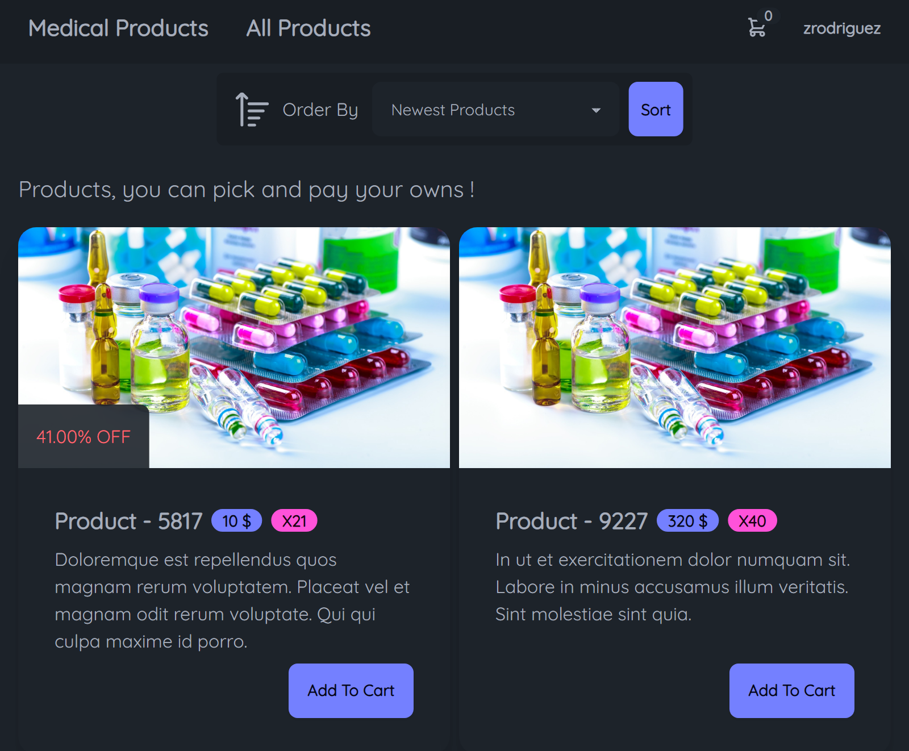
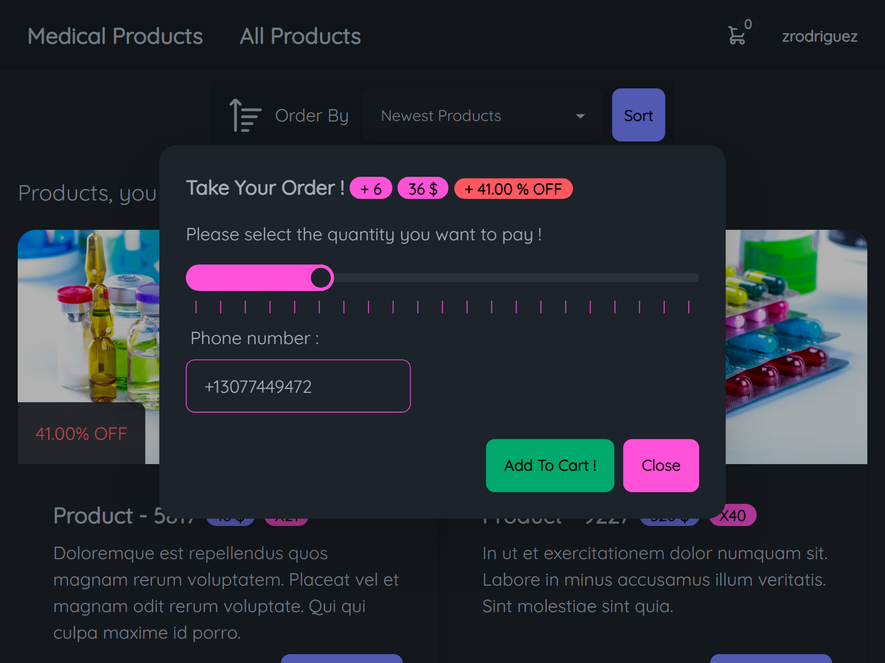

# Medical Products TSH - PHP 💊🛒

### This project is a mini framework developed by me ! includes models, dbms, cache, and any other needed to develop this project. 
#### You can choice your own product buy and use it, in addition may have a special Offer. so look for our shop to reach your needs .
#### In fact i tried make an awesome project as i can make clean and semantic structures and any other development. 


## Screenshots





## Installation

1. Clone repository
```bash
git clone https://github.com/abolraj/medical-products.git
```
2. Go to the project root dir
```bash
cd medical-products
```

3. Install dependencies via composer
```bash
composer install
```

4. Before any start, you need to set configurations such as database and cache in [`config/`](config/) directory.

5. You must boot the database with run [`database/boot.php`](database/boot.php).

    `reset` arg will reset the database : clear database and boot again

    `seed` arg will insert the database records involving in [database/seeder.php](database/seeder.php)
```bash
php database/boot.php reset seed
```

6. You must link the storage directory to the public directory to app work truely
```bash
# linux
ln -s ~/storage ~/public/storage

# windows
mklink /j .\public\storage .\storage
```

7. Run your web server with send requests to just [`public/index.php`](public/index.php) app file
```bash
# for example and easy installation
# you can use this method
php -S localhost:8080 -t public
```
8. Now open this url [`https://localhost:8080`](https://localhost:8080) in your browser ...

You can see the app live !

## App Structure ( Mini Framework )
```bash
Mini-Framework Directories
├───app         # core classes, helpers, requirements, ...
│   ├───Cache               # cache classes 
│   ├───DBMS                # dbms classes
│   ├───HTTP                # http classes
│   │   └───Middleware      # middleware classes
│   └───Model               # models for every database table
├───config      # configuration json files
├───database    # database core involves booting, resetting, seeding, fakers
├───public      # the core routing project that every request starts from here (index.php)
├───routes      # the app http routes
├───storage     # the storge for storing (will create if needed automatically)
└───views       # the views to render page
    ├───auth        
    ├───layout  # basic layouts needed to work the project; inolves header, footer, ...
    ├───orders
    └───products
```

## Environment Variables

To run this project, you will need to have the following environment variables truely in your .env file

`APP_NAME` The name of the app

`APP_TITLE` The title of the app showed in title of page

`APP_DESCRIPTION` The description of app used in meta description tag

`APP_THEME` The theme for the app from Daisy UI themes the values: dark, light, pastel, ...

`DEBUG_MODE` Enable debug mode : 1 => yes, 0 => not

`CACHE_ENABLED` Enable caching : 1 => yes, 0 => not


## Tech Stack

**Client-side** 

    jQuery, TailwindCSS, DaisyUI

**Server-side** 

    Database: MySQl
    Cache: Redis, Memcached
    PHP: Simple PHP Router, PHP Faker


## 🛠 Skills
Fullstack Web Developer ( Expert At Backend )

Back-end : Laravel, Wordpress, PHP

Front-end : React, jQuery, TailwindCSS, Bootstrap5, HTML, CSS, JavaScript

## License
Distributed under the MIT License. See [`LICENSE`](LICENSE) for more information.

## Contact
Abolfazl Rajaee nasab - itgholamollah@email.com

Project Link: [https://github.com/abolraj/medical-products](https://github.com/abolraj/medical-products)
